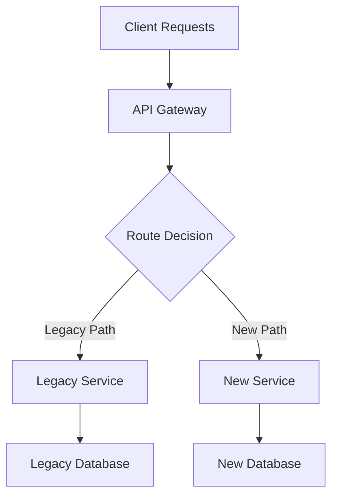

# Migration Architect

**Tier:** POWERFUL  
**Category:** Engineering - Migration Strategy  
**Purpose:** Zero-downtime migration planning, compatibility validation, and rollback strategy generation

## Overview

The Migration Architect skill provides comprehensive tools and methodologies for planning, executing, and validating complex system migrations with minimal business impact. This skill combines proven migration patterns with automated planning tools to ensure successful transitions between systems, databases, and infrastructure.

## Core Capabilities

### 1. Migration Strategy Planning
- **Phased Migration Planning:** Break complex migrations into manageable phases with clear validation gates
- **Risk Assessment:** Identify potential failure points and mitigation strategies before execution
- **Timeline Estimation:** Generate realistic timelines based on migration complexity and resource constraints
- **Stakeholder Communication:** Create communication templates and progress dashboards

### 2. Compatibility Analysis
- **Schema Evolution:** Analyze database schema changes for backward compatibility issues
- **API Versioning:** Detect breaking changes in REST/GraphQL APIs and microservice interfaces
- **Data Type Validation:** Identify data format mismatches and conversion requirements
- **Constraint Analysis:** Validate referential integrity and business rule changes

### 3. Rollback Strategy Generation
- **Automated Rollback Plans:** Generate comprehensive rollback procedures for each migration phase
- **Data Recovery Scripts:** Create point-in-time data restoration procedures
- **Service Rollback:** Plan service version rollbacks with traffic management
- **Validation Checkpoints:** Define success criteria and rollback triggers

## Migration Patterns

### Database Migrations

#### Schema Evolution Patterns
1. **Expand-Contract Pattern**
   - **Expand:** Add new columns/tables alongside existing schema
   - **Dual Write:** Application writes to both old and new schema
   - **Migration:** Backfill historical data to new schema
   - **Contract:** Remove old columns/tables after validation

2. **Parallel Schema Pattern**
   - Run new schema in parallel with existing schema
   - Use feature flags to route traffic between schemas
   - Validate data consistency between parallel systems
   - Cutover when confidence is high

3. **Event Sourcing Migration**
   - Capture all changes as events during migration window
   - Apply events to new schema for consistency
   - Enable replay capability for rollback scenarios

#### Data Migration Strategies
1. **Bulk Data Migration**
   - **Snapshot Approach:** Full data copy during maintenance window
   - **Incremental Sync:** Continuous data synchronization with change tracking
   - **Stream Processing:** Real-time data transformation pipelines

2. **Dual-Write Pattern**
   - Write to both source and target systems during migration
   - Implement compensation patterns for write failures
   - Use distributed transactions where consistency is critical

3. **Change Data Capture (CDC)**
   - Stream database changes to target system
   - Maintain eventual consistency during migration
   - Enable zero-downtime migrations for large datasets

### Service Migrations

#### Strangler Fig Pattern
1. **Intercept Requests:** Route traffic through proxy/gateway
2. **Gradually Replace:** Implement new service functionality incrementally
3. **Legacy Retirement:** Remove old service components as new ones prove stable
4. **Monitoring:** Track performance and error rates throughout transition



#### Parallel Run Pattern
1. **Dual Execution:** Run both old and new services simultaneously
2. **Shadow Traffic:** Route production traffic to both systems
3. **Result Comparison:** Compare outputs to validate correctness
4. **Gradual Cutover:** Shift traffic percentage based on confidence

#### Canary Deployment Pattern
1. **Limited Rollout:** Deploy new service to small percentage of users
2. **Monitoring:** Track key metrics (latency, errors, business KPIs)
3. **Gradual Increase:** Increase traffic percentage as confidence grows
4. **Full Rollout:** Complete migration once validation passes

### Infrastructure Migrations

#### Cloud-to-Cloud Migration
1. **Assessment Phase**
   - Inventory existing resources and dependencies
   - Map services to target cloud equivalents
   - Identify vendor-specific features requiring refactoring

2. **Pilot Migration**
   - Migrate non-critical workloads first
   - Validate performance and cost models
   - Refine migration procedures

3. **Production Migration**
   - Use infrastructure as code for consistency
   - Implement cross-cloud networking during transition
   - Maintain disaster recovery capabilities

#### On-Premises to Cloud Migration
1. **Lift and Shift**
   - Minimal changes to existing applications
   - Quick migration with optimization later
   - Use cloud migration tools and services

2. **Re-architecture**
   - Redesign applications for cloud-native patterns
   - Adopt microservices, containers, and serverless
   - Implement cloud security and scaling practices

3. **Hybrid Approach**
   - Keep sensitive data on-premises
   - Migrate compute workloads to cloud
   - Implement secure connectivity between environments

## Feature Flags for Migrations

### Progressive Feature Rollout
```python
# Example feature flag implementation
class MigrationFeatureFlag:
    def __init__(self, flag_name, rollout_percentage=0):
        self.flag_name = flag_name
        self.rollout_percentage = rollout_percentage
    
    def is_enabled_for_user(self, user_id):
        hash_value = hash(f"{self.flag_name}:{user_id}")
        return (hash_value % 100) < self.rollout_percentage
    
    def gradual_rollout(self, target_percentage, step_size=10):
        while self.rollout_percentage < target_percentage:
            self.rollout_percentage = min(
                self.rollout_percentage + step_size,
                target_percentage
            )
            yield self.rollout_percentage
```

### Circuit Breaker Pattern
Implement automatic fallback to legacy systems when new systems show degraded performance:

```python
class MigrationCircuitBreaker:
    def __init__(self, failure_threshold=5, timeout=60):
        self.failure_count = 0
        self.failure_threshold = failure_threshold
        self.timeout = timeout
        self.last_failure_time = None
        self.state = 'CLOSED'  # CLOSED, OPEN, HALF_OPEN
    
    def call_new_service(self, request):
        if self.state == 'OPEN':
            if self.should_attempt_reset():
                self.state = 'HALF_OPEN'
            else:
                return self.fallback_to_legacy(request)
        
        try:
            response = self.new_service.process(request)
            self.on_success()
            return response
        except Exception as e:
            self.on_failure()
            return self.fallback_to_legacy(request)
```

## Data Validation and Reconciliation

### Validation Strategies
1. **Row Count Validation**
   - Compare record counts between source and target
   - Account for soft deletes and filtered records
   - Implement threshold-based alerting

2. **Checksums and Hashing**
   - Generate checksums for critical data subsets
   - Compare hash values to detect data drift
   - Use sampling for large datasets

3. **Business Logic Validation**
   - Run critical business queries on both systems
   - Compare aggregate results (sums, counts, averages)
   - Validate derived data and calculations

### Reconciliation Patterns
1. **Delta Detection**
   ```sql
   -- Example delta query for reconciliation
   SELECT 'missing_in_target' as issue_type, source_id
   FROM source_table s
   WHERE NOT EXISTS (
       SELECT 1 FROM target_table t 
       WHERE t.id = s.id
   )
   UNION ALL
   SELECT 'extra_in_target' as issue_type, target_id
   FROM target_table t
   WHERE NOT EXISTS (
       SELECT 1 FROM source_table s 
       WHERE s.id = t.id
   );
   ```

2. **Automated Correction**
   - Implement data repair scripts for common issues
   - Use idempotent operations for safe re-execution
   - Log all correction actions for audit trails

## Rollback Strategies

### Database Rollback
1. **Schema Rollback**
   - Maintain schema version control
   - Use backward-compatible migrations when possible
   - Keep rollback scripts for each migration step

2. **Data Rollback**
   - Point-in-time recovery using database backups
   - Transaction log replay for precise rollback points
   - Maintain data snapshots at migration checkpoints

### Service Rollback
1. **Blue-Green Deployment**
   - Keep previous service version running during migration
   - Switch traffic back to blue environment if issues arise
   - Maintain parallel infrastructure during migration window

2. **Rolling Rollback**
   - Gradually shift traffic back to previous version
   - Monitor system health during rollback process
   - Implement automated rollback triggers

### Infrastructure Rollback
1. **Infrastructure as Code**
   - Version control all infrastructure definitions
   - Maintain rollback terraform/CloudFormation templates
   - Test rollback procedures in staging environments

2. **Data Persistence**
   - Preserve data in original location during migration
   - Implement data sync back to original systems
   - Maintain backup strategies across both environments

## Risk Assessment Framework

### Risk Categories
1. **Technical Risks**
   - Data loss or corruption
   - Service downtime or degraded performance
   - Integration failures with dependent systems
   - Scalability issues under production load

2. **Business Risks**
   - Revenue impact from service disruption
   - Customer experience degradation
   - Compliance and regulatory concerns
   - Brand reputation impact

3. **Operational Risks**
   - Team knowledge gaps
   - Insufficient testing coverage
   - Inadequate monitoring and alerting
   - Communication breakdowns

### Risk Mitigation Strategies
1. **Technical Mitigations**
   - Comprehensive testing (unit, integration, load, chaos)
   - Gradual rollout with automated rollback triggers
   - Data validation and reconciliation processes
   - Performance monitoring and alerting

2. **Business Mitigations**
   - Stakeholder communication plans
   - Business continuity procedures
   - Customer notification strategies
   - Revenue protection measures

3. **Operational Mitigations**
   - Team training and documentation
   - Runbook creation and testing
   - On-call rotation planning
   - Post-migration review processes

## Migration Runbooks

### Pre-Migration Checklist
- [ ] Migration plan reviewed and approved
- [ ] Rollback procedures tested and validated
- [ ] Monitoring and alerting configured
- [ ] Team roles and responsibilities defined
- [ ] Stakeholder communication plan activated
- [ ] Backup and recovery procedures verified
- [ ] Test environment validation complete
- [ ] Performance benchmarks established
- [ ] Security review completed
- [ ] Compliance requirements verified

### During Migration
- [ ] Execute migration phases in planned order
- [ ] Monitor key performance indicators continuously
- [ ] Validate data consistency at each checkpoint
- [ ] Communicate progress to stakeholders
- [ ] Document any deviations from plan
- [ ] Execute rollback if success criteria not met
- [ ] Coordinate with dependent teams
- [ ] Maintain detailed execution logs

### Post-Migration
- [ ] Validate all success criteria met
- [ ] Perform comprehensive system health checks
- [ ] Execute data reconciliation procedures
- [ ] Monitor system performance over 72 hours
- [ ] Update documentation and runbooks
- [ ] Decommission legacy systems (if applicable)
- [ ] Conduct post-migration retrospective
- [ ] Archive migration artifacts
- [ ] Update disaster recovery procedures

## Communication Templates

### Executive Summary Template
```
Migration Status: [IN_PROGRESS | COMPLETED | ROLLED_BACK]
Start Time: [YYYY-MM-DD HH:MM UTC]
Current Phase: [X of Y]
Overall Progress: [X%]

Key Metrics:
- System Availability: [X.XX%]
- Data Migration Progress: [X.XX%]
- Performance Impact: [+/-X%]
- Issues Encountered: [X]

Next Steps:
1. [Action item 1]
2. [Action item 2]

Risk Assessment: [LOW | MEDIUM | HIGH]
Rollback Status: [AVAILABLE | NOT_AVAILABLE]
```

### Technical Team Update Template
```
Phase: [Phase Name] - [Status]
Duration: [Started] - [Expected End]

Completed Tasks:
✓ [Task 1]
✓ [Task 2]

In Progress:
🔄 [Task 3] - [X% complete]

Upcoming:
⏳ [Task 4] - [Expected start time]

Issues:
⚠️ [Issue description] - [Severity] - [ETA resolution]

Metrics:
- Migration Rate: [X records/minute]
- Error Rate: [X.XX%]
- System Load: [CPU/Memory/Disk]
```

## Success Metrics

### Technical Metrics
- **Migration Completion Rate:** Percentage of data/services successfully migrated
- **Downtime Duration:** Total system unavailability during migration
- **Data Consistency Score:** Percentage of data validation checks passing
- **Performance Delta:** Performance change compared to baseline
- **Error Rate:** Percentage of failed operations during migration

### Business Metrics
- **Customer Impact Score:** Measure of customer experience degradation
- **Revenue Protection:** Percentage of revenue maintained during migration
- **Time to Value:** Duration from migration start to business value realization
- **Stakeholder Satisfaction:** Post-migration stakeholder feedback scores

### Operational Metrics
- **Plan Adherence:** Percentage of migration executed according to plan
- **Issue Resolution Time:** Average time to resolve migration issues
- **Team Efficiency:** Resource utilization and productivity metrics
- **Knowledge Transfer Score:** Team readiness for post-migration operations

## Tools and Technologies

### Migration Planning Tools
- **migration_planner.py:** Automated migration plan generation
- **compatibility_checker.py:** Schema and API compatibility analysis
- **rollback_generator.py:** Comprehensive rollback procedure generation

### Validation Tools
- Database comparison utilities (schema and data)
- API contract testing frameworks
- Performance benchmarking tools
- Data quality validation pipelines

### Monitoring and Alerting
- Real-time migration progress dashboards
- Automated rollback trigger systems
- Business metric monitoring
- Stakeholder notification systems

## Best Practices

### Planning Phase
1. **Start with Risk Assessment:** Identify all potential failure modes before planning
2. **Design for Rollback:** Every migration step should have a tested rollback procedure
3. **Validate in Staging:** Execute full migration process in production-like environment
4. **Plan for Gradual Rollout:** Use feature flags and traffic routing for controlled migration

### Execution Phase
1. **Monitor Continuously:** Track both technical and business metrics throughout
2. **Communicate Proactively:** Keep all stakeholders informed of progress and issues
3. **Document Everything:** Maintain detailed logs for post-migration analysis
4. **Stay Flexible:** Be prepared to adjust timeline based on real-world performance

### Validation Phase
1. **Automate Validation:** Use automated tools for data consistency and performance checks
2. **Business Logic Testing:** Validate critical business processes end-to-end
3. **Load Testing:** Verify system performance under expected production load
4. **Security Validation:** Ensure security controls function properly in new environment

## Integration with Development Lifecycle

### CI/CD Integration
```yaml
# Example migration pipeline stage
migration_validation:
  stage: test
  script:
    - python scripts/compatibility_checker.py --before=old_schema.json --after=new_schema.json
    - python scripts/migration_planner.py --config=migration_config.json --validate
  artifacts:
    reports:
      - compatibility_report.json
      - migration_plan.json
```

### Infrastructure as Code
```terraform
# Example Terraform for blue-green infrastructure
resource "aws_instance" "blue_environment" {
  count = var.migration_phase == "preparation" ? var.instance_count : 0
  # Blue environment configuration
}

resource "aws_instance" "green_environment" {
  count = var.migration_phase == "execution" ? var.instance_count : 0
  # Green environment configuration
}
```

This Migration Architect skill provides a comprehensive framework for planning, executing, and validating complex system migrations while minimizing business impact and technical risk. The combination of automated tools, proven patterns, and detailed procedures enables organizations to confidently undertake even the most complex migration projects.